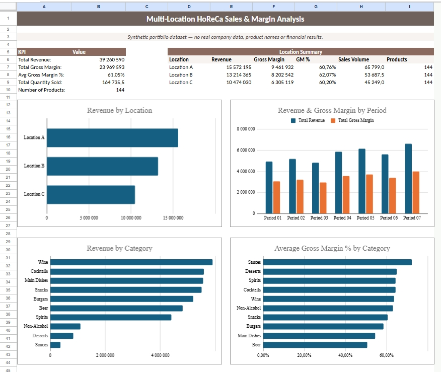
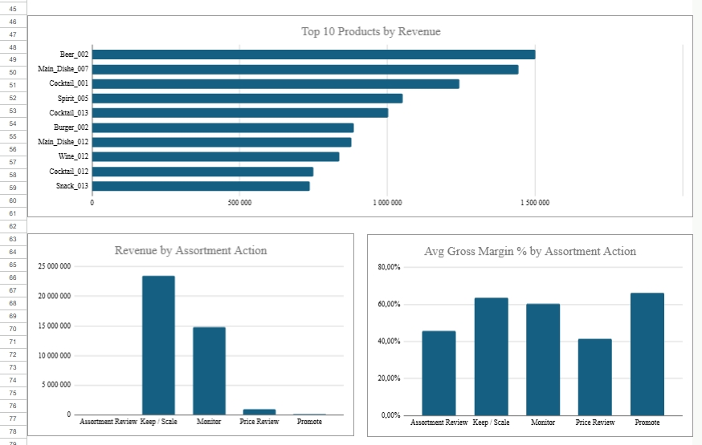
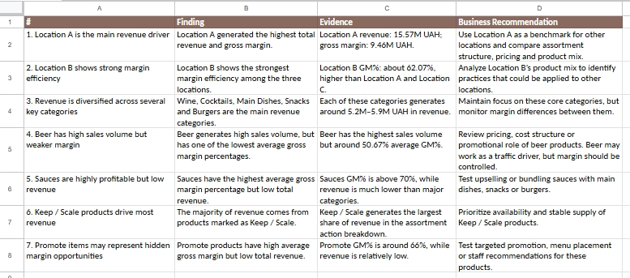
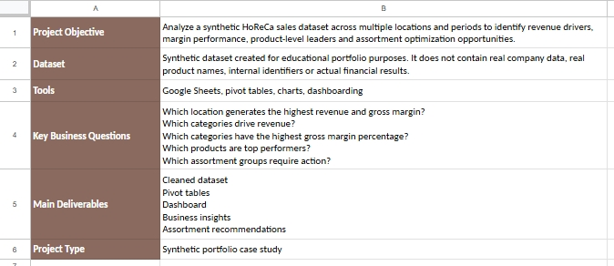

# Multi-Location HoReCa Sales & Margin Analysis

## Project Overview

This is a data analytics portfolio project focused on sales and gross margin analysis for a synthetic HoReCa dataset.

The project analyzes product-level sales data across multiple locations and periods to identify revenue drivers, margin performance, top-performing products and assortment optimization opportunities.

The dashboard was built in **Google Sheets** using cleaned data, pivot tables, charts and business recommendations.

## Dataset

The dataset was created for educational portfolio purposes.

It does **not** contain:

* real company data
* real product names
* internal identifiers
* actual financial results

The dataset is synthetic and inspired by a typical HoReCa sales reporting structure.

## Tools Used

* Google Sheets
* Pivot Tables
* Charts
* Dashboarding
* KPI Reporting
* Business Analysis

## Key Business Questions

The analysis was designed to answer the following questions:

* Which location generates the highest revenue and gross margin?
* Which categories drive revenue?
* Which categories have the highest gross margin percentage?
* Which products are top performers?
* Which assortment groups require action?
* Which products may need promotion, price review or monitoring?

## Dashboard

View the Google Sheets project here:

[[Google Sheets link here]](https://docs.google.com/spreadsheets/d/1cdnufDnWniVVIliAL-THreM3ugtYAr4K/edit?usp=sharing&ouid=102886842852553523440&rtpof=true&sd=true)

## Dashboard Preview

## Product Performance & Assortment Analysis

## Business Insights

## Project Summary

## Key Insights

### 1. Location A is the main revenue driver

Location A generated the highest total revenue and gross margin. It can be used as a benchmark for comparing assortment structure, pricing and product mix across other locations.

### 2. Location B shows strong margin efficiency

Location B demonstrated the strongest gross margin efficiency among the three locations, indicating a potentially stronger product mix or pricing structure.

### 3. Revenue is diversified across several key categories

Wine, Cocktails, Main Dishes, Snacks and Burgers were the core revenue categories. This indicates that revenue is not fully dependent on a single product group.

### 4. Beer has high sales volume but weaker margin performance

Beer showed strong sales volume, but one of the lowest average gross margin percentages. This may indicate that beer works as a traffic-driving category, but its margin should be monitored.

### 5. Sauces are highly profitable but low revenue

Sauces had the highest average gross margin percentage but relatively low total revenue. This creates a potential opportunity for upselling, bundling or better menu placement.

### 6. Keep / Scale products drive most revenue

The majority of revenue came from products marked as Keep / Scale. These products should be prioritized for availability and stable supply.

### 7. Promote items may represent hidden margin opportunities

Products marked as Promote showed high average gross margin but low total revenue. These products may benefit from targeted promotion, better menu placement or staff recommendations.

## Deliverables

* Cleaned dataset
* Pivot tables
* Dashboard
* Business insights
* Assortment recommendations

## Project Type

Synthetic portfolio case study.
